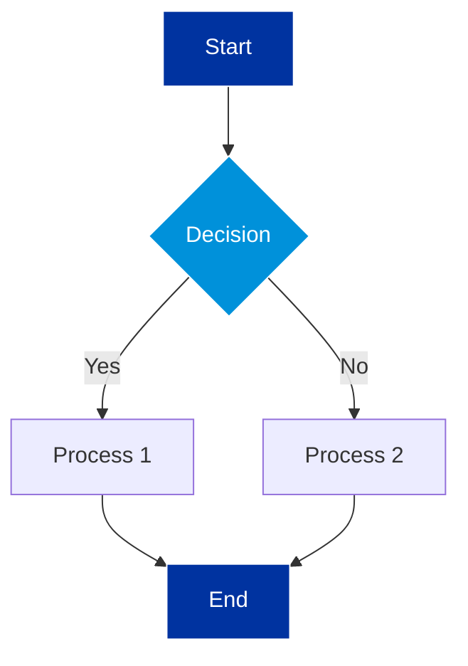
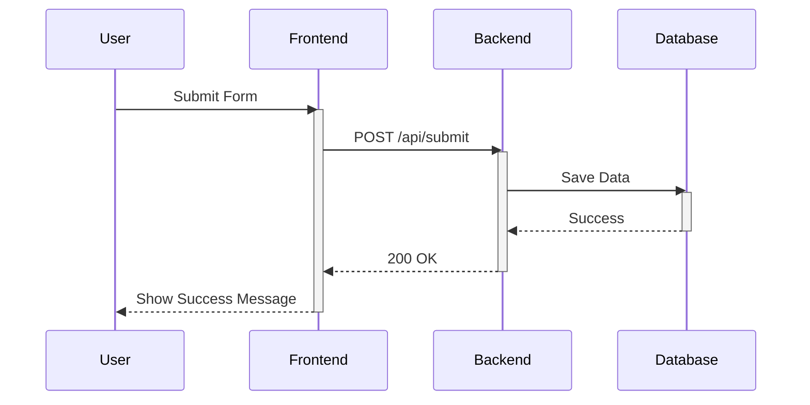
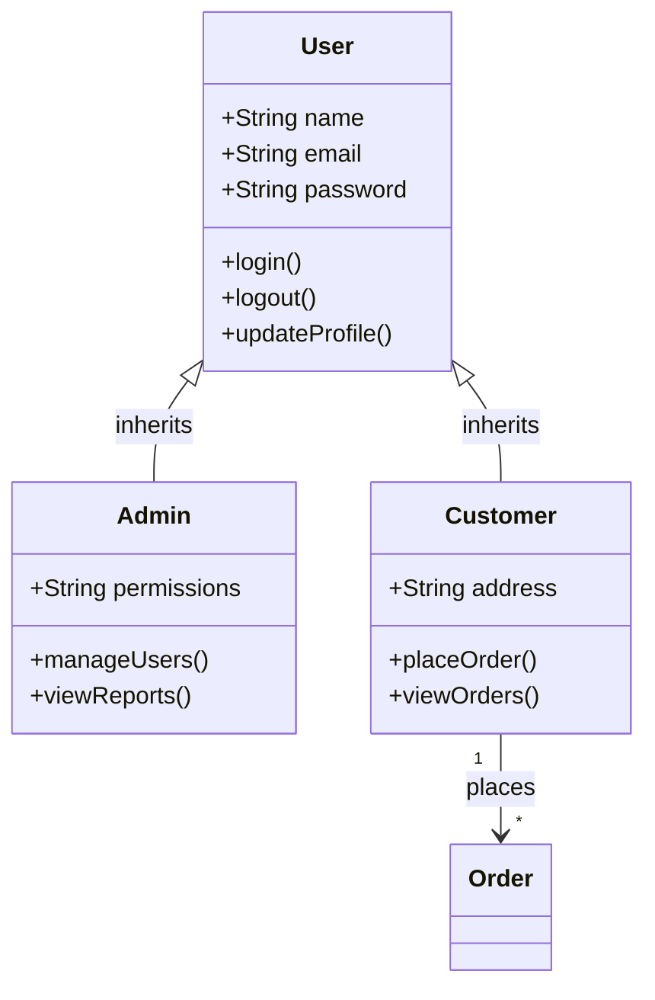
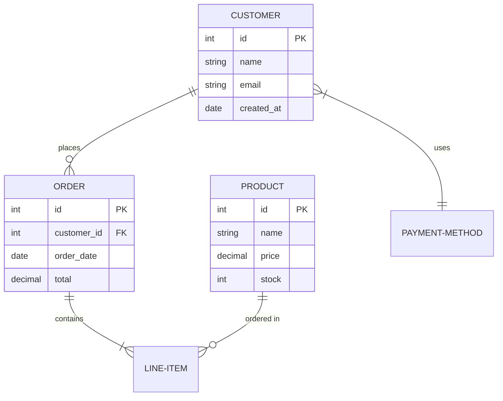
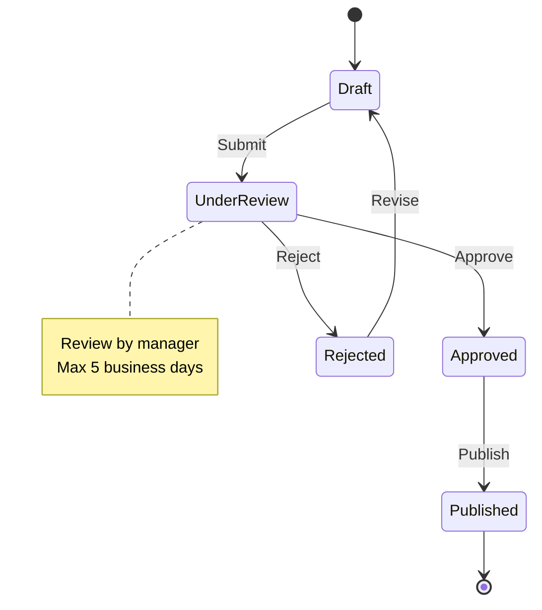
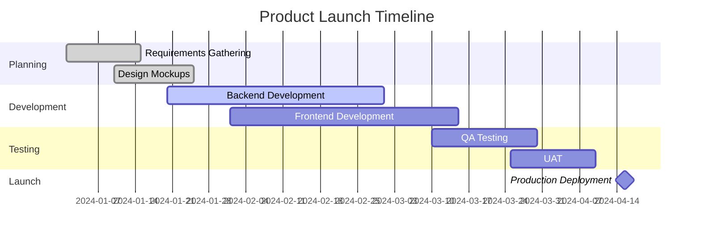
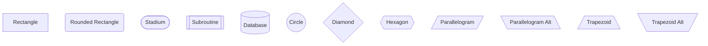
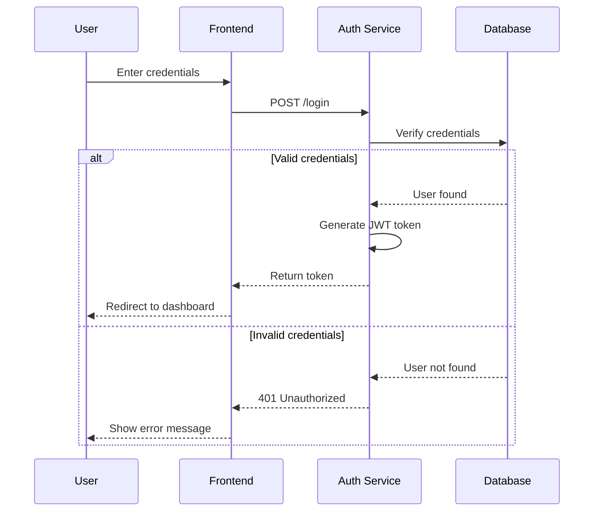
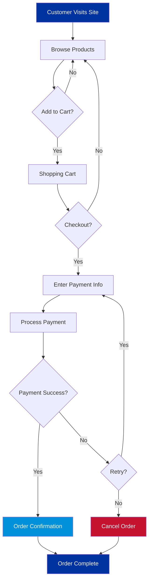
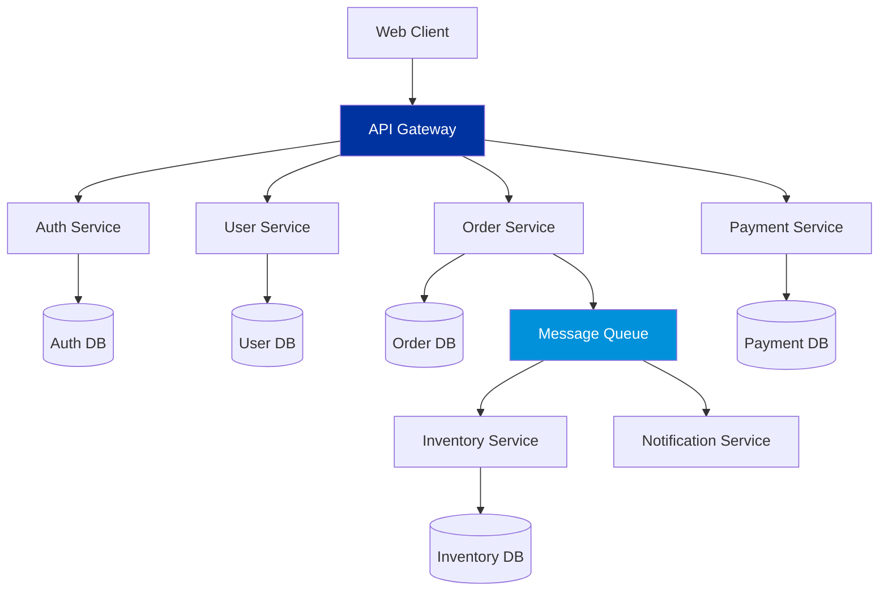

# Mermaid Diagram Generation Skill

## Capability

Generate technical diagrams using Mermaid markdown syntax for flowcharts, sequence diagrams, class diagrams, ER diagrams, state diagrams, and Gantt charts. Render diagrams as SVG or PNG for embedding in slides.

## When to Use

- Web Chart Designer needs to create technical diagrams
- Process flows, system architecture, or workflow visualization required
- Database schema or entity relationships need visualization
- Project timelines or dependencies need Gantt chart representation
- Sequence of system interactions needs illustration

## Supported Diagram Types

### 1. Flowchart
**Use for**: Process steps, decision trees, workflow diagrams
**Syntax**: `graph TD` (top-down), `graph LR` (left-right)

### 2. Sequence Diagram
**Use for**: System interactions over time, API call flows, user journeys
**Syntax**: `sequenceDiagram`

### 3. Class Diagram
**Use for**: Object-oriented structures, system components, relationships
**Syntax**: `classDiagram`

### 4. Entity-Relationship Diagram
**Use for**: Database schema, data models, entity relationships
**Syntax**: `erDiagram`

### 5. State Diagram
**Use for**: State machines, workflow states, system states
**Syntax**: `stateDiagram-v2`

### 6. Gantt Chart
**Use for**: Project timelines, task dependencies, schedules
**Syntax**: `gantt`

### 7. Git Graph
**Use for**: Git branch workflows, version control visualization
**Syntax**: `gitGraph`

## Syntax Examples

### Flowchart (Process Flow)


**Explanation**:
- `graph TD`: Top-down flowchart
- `A[Start]`: Rectangle node
- `B{Decision}`: Diamond node (decision)
- `-->`: Arrow connecting nodes
- `|Label|`: Label on arrow
- `style`: Custom styling for nodes

### Sequence Diagram (System Interaction)


**Explanation**:
- `participant`: Define actors/systems
- `->>`: Solid arrow (synchronous call)
- `-->>`: Dashed arrow (response)
- `activate`/`deactivate`: Show execution time
- `Note`: Add annotations

### Class Diagram (Object-Oriented Structure)


**Explanation**:
- `class`: Define class with properties and methods
- `+`: Public member
- `-`: Private member
- `#`: Protected member
- `<|--`: Inheritance
- `-->`: Association
- `"1" --> "*"`: Cardinality (one-to-many)

### ER Diagram (Database Schema)


**Explanation**:
- `||--o{`: One-to-many relationship
- `||--|{`: One-to-one-or-more
- `}|--||`: Many-to-one
- `PK`: Primary key
- `FK`: Foreign key
- Define entity attributes with types

### State Diagram (Workflow States)


**Explanation**:
- `[*]`: Start/end state
- `-->`: Transition
- `Label : Action`: Transition label
- `note`: Add annotations

### Gantt Chart (Project Timeline)


**Explanation**:
- `title`: Chart title
- `dateFormat`: Date format specification
- `section`: Group tasks
- `:done`: Completed task
- `:active`: Current task
- `:milestone`: Milestone marker
- `task_id`: Reference for dependencies

## Styling and Customization

### Custom Colors


### Node Shapes


### Arrow Types
```mermaid
graph LR
    A --> B  %% Solid arrow
    A -.-> C  %% Dotted arrow
    A ==> D  %% Thick arrow
    A --text--> E  %% Arrow with text
    A ---|text| F  %% Line with text
```

## Integration with Slides

### Method 1: Mermaid Live Editor
1. Go to https://mermaid.live/
2. Paste Mermaid code
3. Export as SVG or PNG
4. Embed in Google Slides

### Method 2: HTML Rendering
```html
<!DOCTYPE html>
<html>
<head>
  <script src="https://cdn.jsdelivr.net/npm/mermaid@10.6.1/dist/mermaid.min.js"></script>
  <script>
    mermaid.initialize({ startOnLoad: true, theme: 'default' });
  </script>
</head>
<body>
  <div class="mermaid">
    graph TD
        A[Start] --> B[Process]
        B --> C[End]
  </div>
</body>
</html>
```

### Method 3: CLI Tool (for automation)
```bash
# Install mermaid-cli
npm install -g @mermaid-js/mermaid-cli

# Generate PNG from mermaid file
mmdc -i diagram.mmd -o diagram.png -w 1920 -H 1080

# Generate SVG
mmdc -i diagram.mmd -o diagram.svg
```

## Common Patterns

### Pattern 1: User Authentication Flow


### Pattern 2: E-Commerce Order Process


### Pattern 3: Microservices Architecture


## Output Format

### Mermaid Diagram Deliverable
```markdown
## Diagram: [Slide Number] - [Diagram Title]

### Diagram Type: [Flowchart / Sequence / Class / ER / State / Gantt]

### Purpose
[What does this diagram illustrate?]

### Mermaid Code
```mermaid
[Complete Mermaid syntax]
```

### Rendering Instructions
1. **Option 1**: Use Mermaid Live Editor
   - Visit: https://mermaid.live/
   - Paste code above
   - Export as SVG (recommended) or PNG
   - Download and embed in slide

2. **Option 2**: Use mermaid-cli
   ```bash
   mmdc -i diagram.mmd -o diagram.svg -w 1920 -H 1080
   ```

3. **Option 3**: HTML rendering
   [Provide HTML file with embedded Mermaid]

### Styling Applied
- Primary color: #0033A0 (brand blue)
- Secondary color: #0091DA (light blue)
- Highlight color: #0091DA
- Node shape: [Rectangle / Diamond / Circle]

### Dimensions
- **Width**: 1920px (full slide width)
- **Height**: 1080px (full slide height)
- **Aspect Ratio**: 16:9

### Alt Text
[Descriptive text for accessibility]

### Usage Notes
- Position: [Center / Left / Right of slide]
- Text overlay: [If applicable]
- Animation: [Fade-in / None]
```

## Best Practices

### Simplicity
- Keep diagrams focused (one concept per diagram)
- Limit nodes to 10-15 for readability
- Use sections/subgraphs to organize complex diagrams

### Clarity
- Use descriptive labels (not abbreviations)
- Add notes for complex steps
- Highlight critical paths or decisions

### Consistency
- Use consistent node shapes for similar elements
- Apply brand colors (MAYO blue, etc.)
- Maintain visual hierarchy (important nodes larger/bold)

### Accessibility
- Provide alt text describing diagram flow
- Use color AND shape to convey meaning (not color alone)
- Ensure sufficient contrast for readability

## Quality Checklist

Before completing diagram, verify:
- [ ] Diagram type appropriate for content (flow vs sequence vs class)
- [ ] All nodes have clear, descriptive labels
- [ ] Arrows indicate correct direction of flow
- [ ] Colors align with visual design palette
- [ ] Diagram renders correctly (no syntax errors)
- [ ] Exported at correct resolution (1920x1080)
- [ ] Alt text provided for accessibility
- [ ] Diagram is not overcrowded (max 15 nodes)
- [ ] Critical paths or insights are highlighted
- [ ] Diagram supports slide narrative

## Related Skills

- `chart-library-integration` - For data-driven visualizations
- `data-transformation` - For preparing data for diagrams
- `image-generation` - For custom illustrations

---

**Version**: 1.0 | **Created**: 2026-02-11
